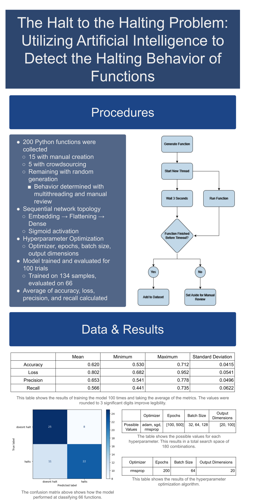

# ISEF Logbook
### James Mathis

## 9/25/23

I spent the day working on generating random functions to train on. I already had the code to generate random functions, but now I want to run each function to see whether it halts or not programmatically rather than having to manually review every single one. The function will run in a separate thread and if it ends before 10 seconds, it'll be placed in the dataset with the "halts" flag. If it runs longer than 10 seconds, the thread will be killed and the function will be set aside in a separate file for manual review. There have been issues trying to convert the random function from a string to an actual callable function.

The [Python threading library](https://docs.python.org/3/library/threading.html) is being used to run the function in a separate thread.

Here is a diagram illustrating how data will flow through the function generator when it is finished.

## 9/28/23

I found a copy of Alan Turing's paper where he introduces the Halting Problem. It was found in [*The Essential Turing* by B. J. Copeland](https://www.google.com/books/edition/The_Essential_Turing/VlC5MkVIwqkC?hl=en&gbpv=0). It also has some of Copeland's own thoughts and paraphrasings. I found some interesting information to use in my Introduction of my paper.

## 10/1/23
I found a [research paper by CS Calude and Stay MA](https://www.sciencedirect.com/science/article/pii/S019688580700036X) that found that if a function halts, it is almost guaranteed to do so quickly. This is important to my research because it confirms that using a timeout is a good way to determine if a function halts or not. This will be useful in my Introduction as well.

## 10/3/23

I realized that I was using the exec function entirely wrong. After discovering this, I made the loop to check if the function timed out or not and write it to its corresponding file. I'm also using regex to figure out the name of the function from the string. This is necessary in order to call the function as I cannot assign it to a variable. It results in somewhat ugly code, but I don't see any other solution. The functions are also being timed as they ran. I believe I could find some use for this data in the future.

## 10/5/23

I'm trying to add the break keyword to the functions but that is proving much more difficult than I thought. I have to make sure that the break is actually contained within a loop, but the structure of my program is making this difficult. The functions that generate random statements are all designed to work independently from each other but I need to know the context of the break statement in order to determine whether it is valid or not. I'm going to have to rethink the structure of my program.

## 10/11/23
The function generator can now put break statements in loops. I had to slightly change the structure of the program to make it work. The program now has a global "code" variable that can be accessed by all functions where the code is stored. The function that generates the break statements now has access to the code and can determine whether the break statement is valid or not. 

## 10/12/23
I made the loops and if statements use variables in their conditions. These variables need to have already been assigned, otherwise the program will crash. The way I found to do this is by using regex to search the global code variable for all variable assignments with the expression "var_\d*". This gets every time a variable is used, so I had to cast it to a set to make every item unique. I used this same technique to extend the assignment function to include "+=", "-=", "*=", and "/=".

## 10/13/23
I edited the conditional and loop functions to have more than one statement inside of its block. This was much harder than I anticipated, as it involved using recursion. I have to limit it to using a max of 3 statements within a block, otherwise the program will hit the maximum recursion depth.

## 10/16/23
I had to revert back to a previous version. It seems that by making the functions closer to what you would see in a regular Python function, the chance of getting a random function that never halts becomes almost zero. This is likely because most programming languages aren't built to purposefully create non-halting functions. The only way to avoid this is to limit the realism of the functions, so I reverted back before the loops and ifs used variables.

## 10/17/23
The final step in my project is just to review the potentially non-halting programs. I want to have at least 200 functions in total with a roughly even distribution for maximum training efficiency. I currently have 80 halting functions and 20 non-halting.

## 10/30/23
I just reviewed functions for an hour. I am up to 100 halting and 75 non-halting. I'm going to try to finish the review process tomorrow.

## 10/31/23
I reviewed enough functions to have 200 total with an equal split. After training the model on these, I get between 50% and 60% accuracy. I learned about a method of determining if a neural network is overfitting, so I'm going to try to use that to improve the accuracy. Essentially, I will try different parameters and log the train and test accuracies. The point where the train accuracy begins to decrease while the test accuracy increases is the point of overfitting. I will then use the parameters from before that point.

## 11/1/23
I started working on a hyperparameter optimization algorithm. Keras doesn't have a built in optimization algorithm, so I'm going to make one myself using for loops.

## 11/2/23
I implemented the optimization. The possible values for each hyperparameter are currently as follows:

<table>
    <tr>
        <th>Hyperparameter</th>
        <th>Possible Values</th>
    </tr>
    <tr align='center'>
        <td>Optimizer</td>
        <td>"adam", "sgd", "rmsprop"</td>
    </tr>
    <tr align='center'>
        <td>Epochs (step: 100)</td>
        <td align='right'>[1000, 2000]</td>
    </tr>
    <tr align='center'>
        <td>Batch Size (step: 10)</td>
        <td align='right'>[20, 200]</td>
    </tr>
    <tr>
        <td>Output Dimension (step: 10)</td>
        <td align='right'>[10, 100]</td>
    </tr>
</table>

After the test score is found, the parameters and accuracy are written to a csv for later analysis. Then, the train score is found and is also written to a csv. I think I have some issues in the optimization, as I keep getting a train score of 1.0. I'm going to try to fix this tomorrow.

## 11/3/23
I discovered that the train score was 1 because the model was getting every single function correct in the train predictions. This could indicate overfitting, but I'm going to leave it for now and look at the test score. I decreased the number of epochs to [100, 500] and researched what batch size is exactly to reduce overfitting. I discovered from [DeepLizard](https://deeplizard.com/learn/video/U4WB9p6ODjM) that the batch size is the number of samples passed through the model during training so it should be less than the number of samples in the dataset. It is also best to use a power of 2 for the batch size. Taking this into consideration, I changed the possible batch sizes to 32, 64, and 128.

## 11/14/23
After starting to test the optimization I realized that the smallest epoch value, 100, took around 15 seconds to train and test. Based on the possible values for each hyperparameter, there are 450 possible combinations with steadily increasing epoch values. An increase in epochs directly correlates to an increase in training time, so the optimization would take a very long time to complete. This algorithm also doesn't use cross-validation, so the results could be skewed. I'm going to try to find a better way to optimize the hyperparameters.

## 11/17/23
I began working on the research paper, as it is due in a few weeks. I focused primarily on the Procedures section. I wrote around half of it, including discussing the dataset collection and the model topology.

## 11/20/23
I finished the Procedures section and got feedback from Mr. Seward. I wrote about the optimization algorithm using placeholders for the hyperparameters and the results of the optimization. I also wrote about what I'm going to do to evaluate the model's performance, which is to train and evaluate the model 100 times and get the mean, min, max, and standard deviation of a few metrics.

## 11/21/23
I started work on the Results section of the paper, using placeholders for the results of the model evaluation. I created a table for the results and paragraphs to report them in words.

## 11/22/23
I put in some equations for accuracy, precision, and recall. This was the last thing I needed to do for the Results section.

## 12/2/23
I finished the Results section until I get actual numbers to put in. I also started writing the Introduction section.

## 12/3/23
I finished up the first paragraph of my Introduction. It includes a brief history of the Halting Problem and a summary of the problem.

## 12/5/23
I started writing the Background subsection of the Introduction. I used information from Copeland's book to give more information about how Turing proved the Halting Problem to be undecidable.

## 12/7/23
I found an [article by M Barenkamp et al](https://link.springer.com/article/10.1186/s42467-020-00005-4) about uses of AI in classical software engineering. I used this and the Calude and Stay paper to finish the Background subsection of the Introduction.

## 12/10/23
I added a paragraph for the goal of my research and the significance of my research. I also summarized the Procedures section and added it to the Introduction and the Intro to Procedures.

## 12/14/23
I started filling out the ISEF forms so I could get them signed. I also started working on the Conclusion section of the paper. I did a basic summary of the previous sections and discussed the results, again using placeholders until I get results.

## 12/15/23
I did some research about possible future work and added it to the Conclusion section. I also added a paragraph about the significance of my research. I started working on the Abstract by using the first 2 sentences as a summary of the Introduction.

## 12/16/23
I finished the Abstract and the paper. I also finished the ISEF forms and got them signed. I submitted the paper and the forms to Mr. Seward so he could review them and give feedback.

## 12/17/23
Mr. Seward had minimal feedback for the paper, so I made the changes really quickly. I just had to fix some paragraphs in the Results section that were very boring.

## 1/6/24
I discovered a library called [Keras Tuner](https://keras-team.github.io/keras-tuner/) that is designed to optimize hyperparameters in keras models. However, I really want to use something similar to the sklearn GridSearchCV function, as I'm already familiar with it and it exhaustively searches the search space using cross-validation. I know that keras and sklearn are based on tensorflow, so maybe there's a way to use GridSearchCV with a keras model. I found another library call scikeras that essentially wraps the keras model in a sklearn model. This will let me use GridSearchCV with a keras model.

## 1/9/24
Using the scikeras library was easy. After getting the scikeras model, I used the sklearn GridSearchCV. I used cv = 3, which means that the data is split into 3 parts and the model is trained on 2 parts and tested on the other. This is done 3 times, so every part is used for testing once. Using the same hyperparameter search space as before, the model would have to be trained 1,350 times. This will still take a long time, even with the GridSearchCV's early stopping. I brought the output dimensions down to [20, 100] with a step of 20. This will reduce the number of combinations to 225, so the model will have to be trained 675 times.

Below is the final search space for the hyperparameters:

<table>
    <tr>
        <th>Hyperparameter</th>
        <th>Possible Values</th>
    </tr>
    <tr align='center'>
        <td>Optimizer</td>
        <td>"adam", "sgd", "rmsprop"</td>
    </tr>
    <tr align='center'>
        <td>Epochs (step: 100)</td>
        <td align='right'>[100, 500]</td>
    </tr>
    <tr align='center'>
        <td>Batch Size</td>
        <td align='right'>32, 64, 128</td>
    </tr>
    <tr>
        <td>Output Dimension (step: 20)</td>
        <td align='right'>[20, 100]</td>
    </tr>
</table>

## 1/11/24
I tested the optimization and each train still takes far too long. I looked at the GridSearchCV documentation and found the njobs parameter. This parameter is the number of jobs to run in parallel. I set it to -1, which runs as many parallel jobs as possible. This should reduce the time it takes to train the model. Running this doesn't seem to be any faster. I tried setting njobs to 4, but this caused each thread to use too much memory for my machine.

## 1/18/24
I found a tool from Google called [Colab](https://colab.research.google.com) that allows you to run code on a virtual machine with a GPU for free. I'm going to move my code to Colab and see if the training time is reduced.

## 1/19/24
I moved the code and got it working with Colab. I'm not sure if the training time is reduced, but I'm going to try to optimize the hyperparameters again. I'm going to leave it running overnight and have the results saved to a txt file in Google Drive.

## 1/20/24
I got the results from the optimization. The best hyperparameters were "rmsprop" for the optimizer, 200 epochs, 64 batch size, and 20 output dimension. I can now use these hyperparameters to train the model and evaluate it.

## 1/23/24
I got the code set up to train and evaluate the model 100 times. The accuracy, loss, precision, and recall are all recorded for each trial. After the 100 trials, the mean, min, max, and standard deviation of each metric is calculated and written to a csv. I'm going to run this code overnight and have the results saved to a csv file in Google Drive.

## 1/24/24
I got the results from the 100 trials. The mean accuracy was 0.620, the mean loss was 0.802, the mean precision was 0.653, and the mean recall was 0.566. The standard deviation for each metric was around 0.04. I'm going to use these results to write the Results section of my paper.

## 1/30/24
I finished the Results section of my paper. I also finished the Conclusion section. I'm going to submit the paper to Mr. Seward for final review.

## 2/6/24
I began working on the poster today. I summarized the Procedures section and put it in a bulleted list on my poster, as well as the function flow diagram.

## 2/8/24
I added the Data section to the poster with the confusion matrix and various tables, along with some additional metrics such as F1 score and geometric mean.

## 2/9/24
I finished with the Results section of the poster. I'm working on summarizing all the other sections. Here is the current version of my poster:

## 2/10/24
I summarized the Introduction and Conclusion sections of the paper and put them on the poster. I also added a section for future work.

## 2/12/24
I made some final edits to my poster and submitted it to Mr. Seward for review. He said it looked good, so I'm finished with it.

My code, paper, and poster can be found on Github with the following QR code:

