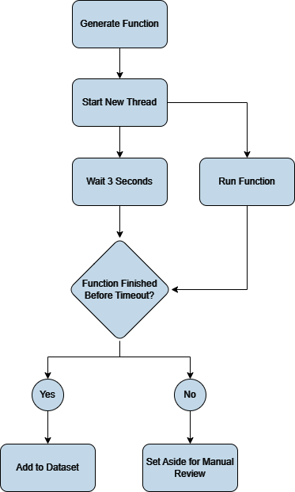

## 9/25/23

I spent the day working on generating random functions to train on. I already had the code to generate random functions, but now I want to run each function to see whether it halts or not programmatically rather than having to manually review every single one. The function will run in a separate thread and if it ends before 10 seconds, it'll be placed in the dataset with the "halts" flag. If it runs longer than 10 seconds, the thread will be killed and the function will be set aside in a separate file for manual review. There have been issues trying to convert the random function from a string to an actual callable function.

The [Python threading library](https://docs.python.org/3/library/threading.html) is being used to run the function in a separate thread.

Here is a diagram illustrating how data will flow through the function generator when it is finished.

## 10/3/23

I realized that I was using the exec function entirely wrong. After discovering this, I made the loop to check if the function timed out or not and write it to its corresponding file. I'm also using regex to figure out the name of the function from the string. This is necessary in order to call the function as I cannot assign it to a variable. It results in somewhat ugly code, but I don't see any other solution. The functions are also being timed as they ran. I believe I could find some use for this data in the future.

## 10/5/23

I'm trying to add the break keyword to the functions but that is proving much more difficult than I thought. I have to make sure that the break is actually contained within a loop, but the structure of my program is making this difficult. The functions that generate random statements are all designed to work independently from each other but I need to know the context of the break statement in order to determine whether it is valid or not. I'm going to have to rethink the structure of my program.

## 10/11/23
The function generator can now put break statements in loops. I had to slightly change the structure of the program to make it work. The program now has a global "code" variable that can be accessed by all functions where the code is stored. The function that generates the break statements now has access to the code and can determine whether the break statement is valid or not. 

## 10/12/23
I made the loops and if statements use variables in their conditions. These variables need to have already been assigned, otherwise the program will crash. The way I found to do this is by using regex to search the global code variable for all variable assignments with the expression "var_\d*". This gets every time a variable is used, so I had to cast it to a set to make every item unique. I used this same technique to extend the assignment function to include "+=", "-=", "*=", and "/=".

## 10/13/23
I edited the conditional and loop functions to have more than one statement inside of its block. This was much harder than I anticipated, as it involved using recursion. I have to limit it to using a max of 3 statements within a block, otherwise the program will hit the maximum recursion depth.